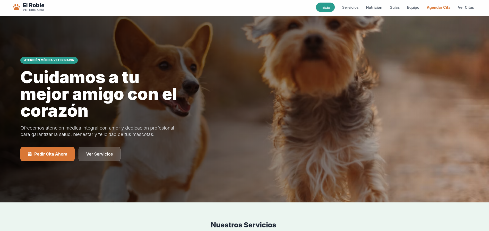

# 🐾 El Roble - Sistema de Gestión Veterinaria

Sistema web para el control de servicios médicos y agendamiento de citas veterinarias desarrollado con **Laravel 11** y **Tailwind CSS**.

---

## 📷 Vista Previa del Sistema

| Página Principal (Landing Page) | Formulario de Agendamiento |
| :---: | :---: |
|  | ![Agendar Cita] |

---

## 🚀 Características

* **Catálogo de Servicios:** Muestra dinámica de servicios almacenados en la base de datos.
* **Agendamiento de Citas:** Formulario para registrar consultas médicas, asignación de fechas, mascotas y dueños en una vista independiente.
* **Base de Datos:** Migraciones y Seeders preconfigurados.
* **Diseño Responsivo:** Interfaz adaptada con estilo cálido utilizando Tailwind CSS.

---

## 🛠️ Tecnologías Utilizadas

* **Framework:** Laravel 11
* **Lenguaje:** PHP 8.x
* **Estilos:** Tailwind CSS / FontAwesome
* **Base de Datos:** SQLite / MySQL

---

## ⚙️ Instalación Local

1. **Clonar el repositorio:**
   ```bash
   git clone [https://github.com/alejandrocastillojose286-source/mascotas.git](https://github.com/alejandrocastillojose286-source/mascotas.git)
   cd mascotas

## 📷 Vista Previa del Sistema

| Página Principal (Landing Page) | Formulario de Agendamiento |
| :---: | :---: |
|  |  |